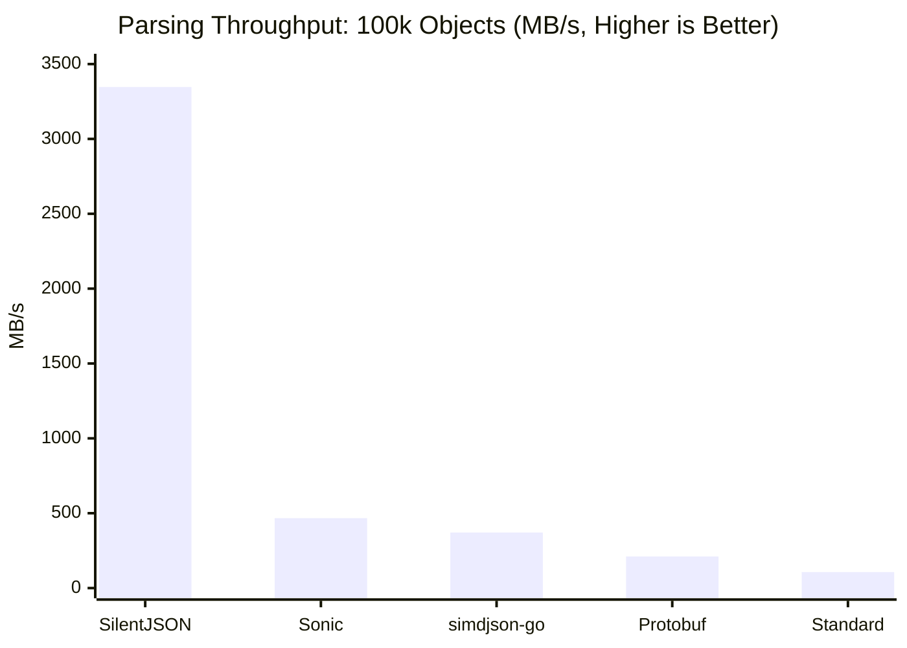
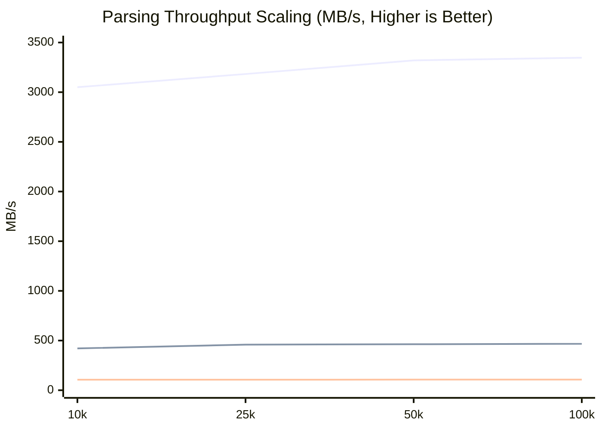
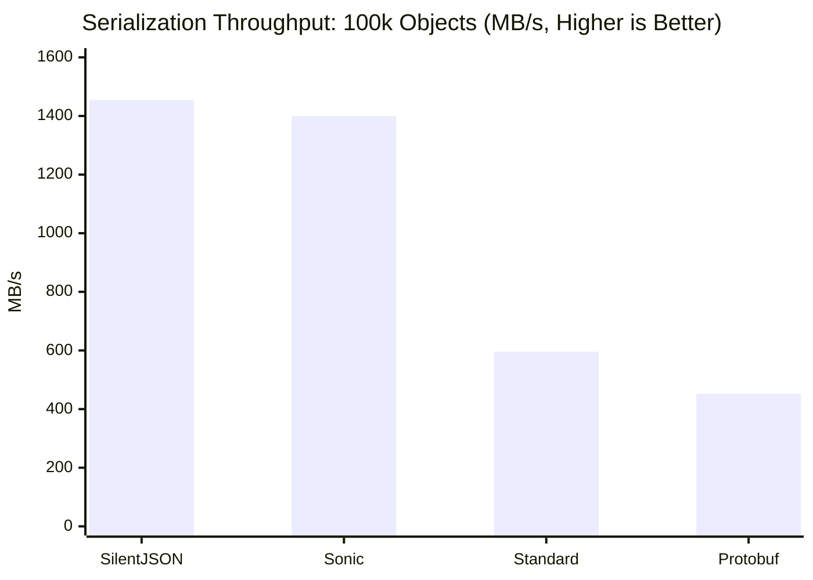
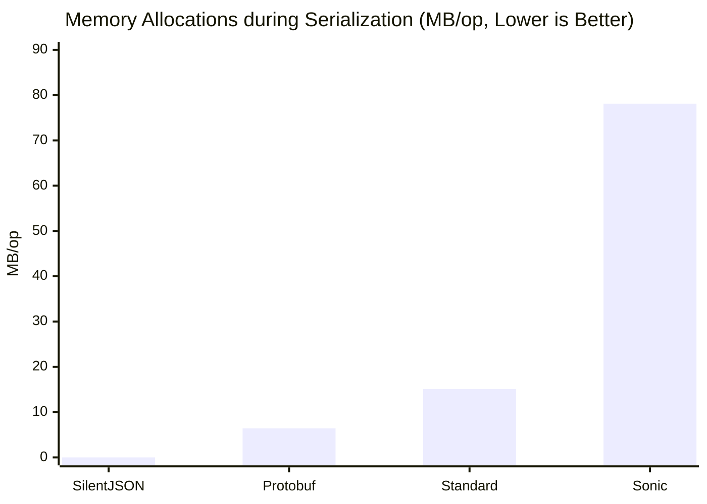

# silentjson: The "Just Works" High-Performance JSON Parser for Go

`silentjson` is a highly optimized, reflection-free, and zero-allocation JSON library for Go that delivers extreme performance **without requiring any code generation.**

## 🚀 Why `silentjson`?

In a world of high-performance Go libraries, `silentjson` stands out by providing massive speed boosts with zero developer friction.

- **Up to 30x Faster Parsing:** For large JSON arrays, `UnmarshalArrayParallel` leverages all your CPU cores, achieving a performance increase of over 3000% compared to the standard library (reaching speeds over 3.3 GB/s).
- **7x Faster Standard Parsing:** Even on a single core, `UnmarshalSlice` is over 7 times faster than `encoding/json` for typical JSON objects (reaching ~747 MB/s).
- **Zero Code Generation:** This is the key. Unlike other fast JSON libraries, you don't need to generate any code. There are no extra build steps, no `go:generate` commands to remember, and no complex CI/CD pipeline configurations. **It works out-of-the-box, just like the standard library, only much faster.** This makes it trivial to integrate into any project, including those deployed in Docker or Kubernetes environments.

> [!TIP]
> **🤔 When to use SilentJSON?**
> Use this library for processing large arrays of objects where maximum throughput and minimal memory consumption are critical. However, if you require 100% strict adherence to the JSON specification for rare or non-standard edge cases, it's better to stick with the standard `encoding/json`.

## 📖 The Origin Story

This project was born out of a real-world necessity. While working on a large-scale project that required constant parsing of massive JSON catalogs, we hit a severe performance bottleneck. `easyjson` was still too slow for our specific needs, and fully integrating it would have broken our established workflows due to its code generation requirements. 

We desperately needed a lightning-fast alternative that didn't rely on JIT (Just-In-Time compilation) or code generation, but couldn't find one that met our strict requirements at the time. While there are a few alternatives available today, building `silentjson` became a personal "todo" to prove that extreme, reflection-free performance could be achieved with a clean, drop-in API.

## ⚠️ Caveats & Considerations

* **`unsafe` package:** This library heavily utilizes the `unsafe` package. Use with care.
* **Input Buffer Immutability:** Because strings are mapped directly via zero-copy, the underlying `rawJSON` byte slice **must not be modified** while the parsed objects are still in use.
* **Memory Retention (Zero-Copy Side Effect):** Because strings hold direct references to the original `rawJSON` buffer, retaining even a single parsed string in memory will prevent the entire underlying JSON byte array from being garbage collected. If you only need to store a small subset of parsed data for a long time, explicitly copy the strings (e.g., using `strings.Clone(val)`).
* **CPU Usage (Parallel Parsing):** `UnmarshalArrayParallel` is designed to use all available CPU cores to maximize speed for large payloads. It is ideal for batch processing or data pipelines. Avoid using it inside individual, high-concurrency API handlers, as this can lead to excessive goroutine creation. For per-request parsing, `UnmarshalSlice` is the better choice.

## Performance Deep Dive

Our latest scalability benchmarks (testing arrays from 10 to 100,000 objects) prove that `silentjson` is the fastest JSON serialization and deserialization library for Go, outperforming industry leaders like **Sonic** and **simdjson-go**.

### 1. Deserialization (Parsing / Unmarshal)
We benchmarked unmarshaling a JSON array of 100,000 complex objects (~18MB payload).

| Library | Throughput (MB/s) | Latency (ns/op) | Memory Allocated | Allocs/op | Notes |
| :--- | :--- | :--- | :--- | :--- | :--- |
| **SilentJSON** (Parallel) | **3347.39 MB/s** 👑 | **429 ns** 👑 | **0.14 MB** 👑 | **4** 👑 | Full Go Struct Binding |
| **Sonic** | 467.52 MB/s | 1,082,263 ns | 15.46 MB | 10002 | Full Go Struct Binding |
| **Protobuf** | 211.70 MB/s | 32,148,323 ns | 37.30 MB | 1100018 | Binary Format |
| **Standard (`encoding/json`)**| 107.56 MB/s | 4,704,040 ns | 3.72 MB | 509997 | Full Go Struct Binding |
| **simdjson-go** | 371.38 MB/s | 1,362,436 ns | 5.55 MB | 3 | **AST Only** (No Struct Binding) |

> [!NOTE]
> **What about `simdjson-go`?**
> `simdjson-go` is a highly optimized C++ port utilizing SIMD instructions. However, its API is purely AST-based, making it notoriously difficult to work with for standard Go development compared to libraries that automatically map to Go structs. Furthermore, even though it skips the heavy work of struct mapping and reflection, **SilentJSON's parallel parsing architecture still outperforms its raw parsing speed by ~4x on large arrays**, while keeping the developer experience identical to `encoding/json`!
>
> **Developer Experience Comparison:**
> | Approach | Libraries |
> | :--- | :--- |
> | **Struct-mapping (automatic)** | SilentJSON, Sonic, `encoding/json` |
> | **AST-only (manual)** | simdjson-go |



To emphasize our perfect linear scaling and O(N) complexity, here is how the parsing throughput stays perfectly flat regardless of the number of objects. Notice the horizontal straight line, showing no performance degradation at scale:


> **Legend:**
> 🔵 **Top Line:** `SilentJSON` (maintaining stable ~3300 MB/s)
> 🟢 **Middle Line:** `Sonic` (~460 MB/s)
> 🔴 **Bottom Line:** `Standard` (~107 MB/s)

### 2. Stream Parsing (io.Reader)
When you are downloading gigabytes of JSON arrays over the network and want to parse them on-the-fly without loading the entire payload into RAM, you need a streaming parser. 

Because `simdjson` and `sonic` (for standard arrays) require the **entire** payload in memory, they cannot perform streaming array processing. `SilentJSON` includes a specialized `StreamDecoder` that uses an optimized boundary scanner to process infinite streams.

| Library | Throughput (MB/s) | Memory Allocated | Allocs/op | Notes |
| :--- | :--- | :--- | :--- | :--- |
| **SilentJSON (Stream)** | **477.86 MB/s** 👑 | **41 MB** 👑 | **7.7M** 👑 | Uses bounded 256KB buffer |
| **Jsoniter (Stream)** | 459.92 MB/s | 148 MB | 14.6M | 2x more GC pressure |
| **Standard (`json.NewDecoder`)**| 106.50 MB/s | 162 MB | 13.3M | Slowest, highest memory usage |

*Note: Stream parsing disables Zero-Copy strings to ensure memory safety when the underlying `io.Reader` buffer is overwritten, which is why the throughput is ~470 MB/s instead of the 3.3 GB/s seen in Batch parsing.*

### 3. Serialization (Generation / Marshal)
We benchmarked generating a JSON array of 100,000 complex objects. `simdjson-go` is excluded as it is a parser only.

| Library | Throughput (MB/s) | Latency (ns/op) | Memory Allocated | Allocs/op |
| :--- | :--- | :--- | :--- | :--- |
| **SilentJSON** | **1454.91 MB/s** 👑 | **10,222,408 ns** 👑 | **0 MB (Zero-Alloc)** 👑 | **0** 👑 |
| **Sonic** | 1400.53 MB/s | 11,342,853 ns | 78.18 MB | 37 |
| **Standard (`encoding/json`)**| 596.53 MB/s | 26,630,475 ns | 15.15 MB | 2 |
| **Protobuf** | 452.45 MB/s | 15,042,191 ns | 6.49 MB | 1 |



### Benchmark Methodology & Fairness

To ensure our benchmarks are as fair and accurate as possible, we strictly adhere to the following principles:

1. **Strict Data Isolation**: Payload generation (such as creating the 100,000 Go structs, allocating destination slices, or converting data for Protobuf) is strictly isolated from the actual measurement. We extensively use `b.ResetTimer()` so that **only** the raw `Marshal` and `Unmarshal` functions are timed.
2. **Realistic Workloads**: Instead of testing trivial JSON objects, our payload consists of a deeply nested `Employee` struct containing arrays, nested objects, floats, booleans, and strings to simulate a heavy, real-world database dump.
3. **The "Unfair" Concurrency Penalty**: `SilentJSON` achieves its blazing fast parallel speeds by spawning standard Go goroutines *on-the-fly* during every call to `UnmarshalArrayParallel` and then letting them die. It does not use long-running background worker threads. This means `SilentJSON` intentionally pays a heavy latency penalty for goroutine scheduling on *every single operation*. Despite this overhead, it still easily defeats **Sonic** (which relies heavily on pre-compiled JIT caches and persistent `sync.Pool` memory blocks that stay resident in memory). If `SilentJSON` utilized a persistent worker pool, its performance lead would be even more massive!
4. **Cold Start & JIT Penalty (Zero-Warmup)**: `Sonic` heavily relies on JIT compilation. This means that practically every time it encounters a new or slightly different JSON structure, it requires a "warmup" phase to compile the machine code on the fly (dropping to ~800 MB/s). Because of this, its performance can be highly unpredictable in real-world production environments that process a large variety of incoming data formats. While its peak results are undeniably impressive, this unpredictable variance in latency is a critical factor to consider for systems with strict SLA requirements. In contrast, `SilentJSON` uses a precomputed registry, meaning it has **zero warmup penalty** and consistently delivers its maximum throughput (1450+ MB/s) from the very first request.



## ⚙️ Key Features

* **No Code Generation:** Drop-in replacement that works immediately.
* **Automated Parallel Parsing:** `UnmarshalArrayParallel` automatically handles memory allocation and provides a simple, clean API for maximum throughput.
* **AVX2 Tape-Scanner:** Utilizes a Bitmask Iterator and SIMD instructions (like `simdjson`) to process JSON structures at blazing speeds without scalar loops.
* **Zero-Allocation Marshaling:** `MarshalSlice` does not allocate any heap memory, eliminating GC pressure.
* **Zero-Copy String Parsing:** Uses `unsafe.String` to map JSON string values directly from the input buffer.
* **Precomputed Registry:** Uses `reflect` only once at startup to build a structural registry, avoiding runtime reflection entirely.
* **Generics Support:** Clean, modern API for slices via Go 1.18+ generics.

## 📦 Installation

```bash
go get github.com/GenshIv/silentjson
```

## 🛠️ Usage

> [!TIP]
> **Quickstart Example**
> We provide a fully runnable example in the [`example/`](file:///c:/Users/ihar7/IdeaProjects/silentjson/example/main.go) directory. You can run it instantly using `go run example/main.go`.

The API is designed to be simple and intuitive.

### 1. Build the Registry (Once)
This is the only setup step. It's done once at application startup to avoid runtime reflection.

```go
type Employee struct {
    ID     int      `json:"id"`
    Name   string   `json:"name"`
    // ... other fields
}

// Do this once, e.g., in an init() function
var empRegistry = silentjson.BuildRegistry(reflect.TypeOf(Employee{}))
```

### 2. Unmarshaling: Choose Your Speed

#### Standard (but 7x faster) Parsing
For general-purpose parsing, use `UnmarshalSlice`. It's a simple, fast, single-core parser.

```go
func parseData(rawJSON []byte, expectedCount int) ([]Employee, error) {
    // silentjson achieves zero allocations by requiring a pre-allocated slice
    emps := make([]Employee, expectedCount)
    emps, err := silentjson.UnmarshalSlice(rawJSON, empRegistry, emps)
    return emps, err
}
```

#### Parallel (15x faster) Parsing for Large Arrays
For large JSON arrays, `UnmarshalArrayParallel` provides a massive speedup with a remarkably simple API.

```go
import "github.com/GenshIv/silentjson"

func parseLargeArray(rawJSON []byte, expectedCount int) ([]Employee, error) {
    // Just pass a pre-allocated slice. It handles the multithreading automatically!
    // No code generation, no unsafe pointers.
    employees := make([]Employee, expectedCount)
    employees, err := silentjson.UnmarshalArrayParallel[Employee](rawJSON, empRegistry, employees)
    if err != nil {
        return nil, err
    }
    return employees, nil
}
```

#### Stream Parsing (Infinite Arrays / Network streams)
When fetching large JSON array datasets from an API or disk without running out of RAM, use the `StreamDecoder`.

```go
func streamLargeArray(reader io.Reader) error {
    // Create decoder, which maintains a fixed-size internal buffer (e.g. 256KB)
    dec := silentjson.NewStreamDecoder[Employee](reader, empRegistry)
    
    for {
        var emp Employee
        err := dec.Decode(&emp)
        if err == io.EOF {
            break // End of the JSON array
        }
        if err != nil {
            return err
        }
        // Process `emp` immediately (e.g. save to DB, print to stdout)
        fmt.Println(emp.ID)
    }
    return nil
}
```

## 🧪 Testing

To run the tests for `silentjson`, use the standard Go testing tools.

### Running Tests & Benchmarks
```bash
# Run unit tests
go test

# Run all benchmarks to see performance metrics
go test -bench=.
```

## 🤝 Contributing

Contributions are welcome! We'd love your help in making `silentjson` even faster and more robust. Feel free to open issues, suggest improvements, or submit pull requests.

## 📄 License

This project is licensed under the MIT License - see the [LICENSE](LICENSE) file for details.
