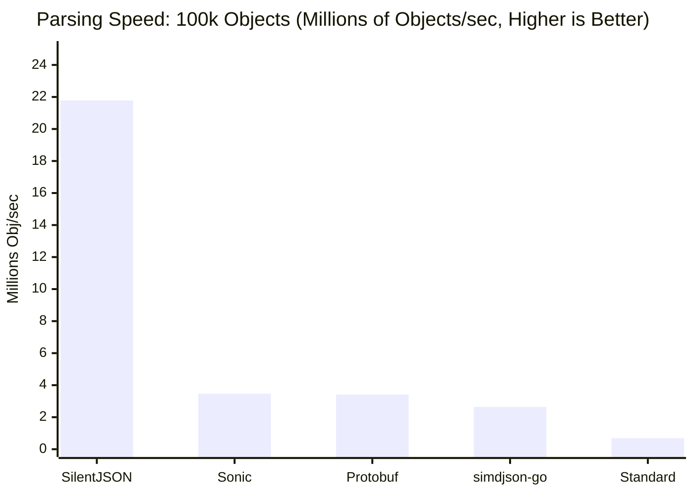
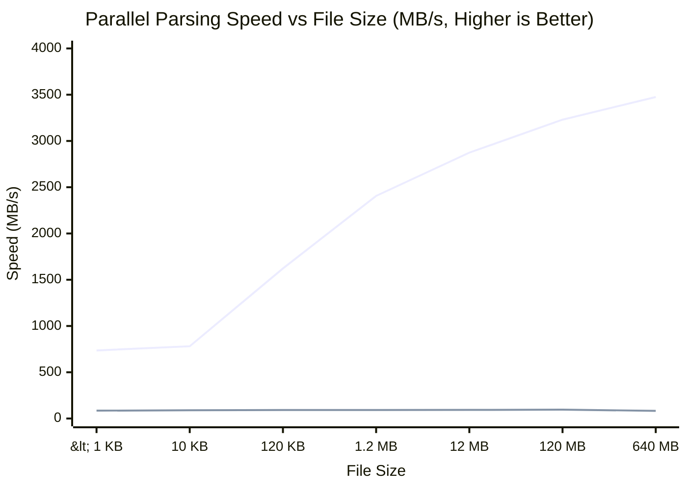
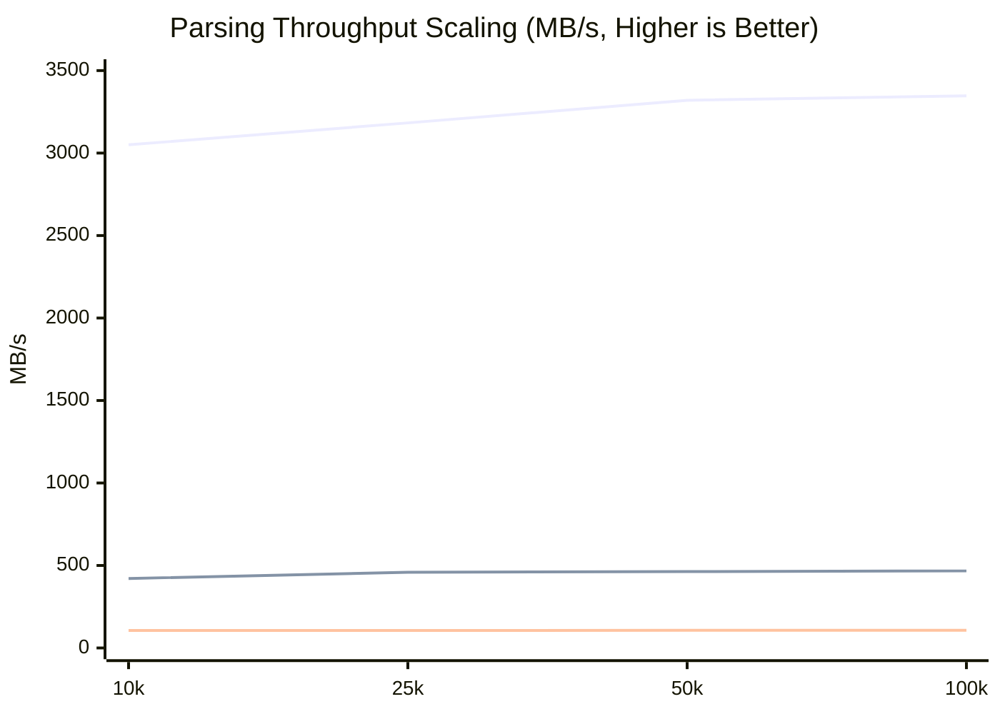
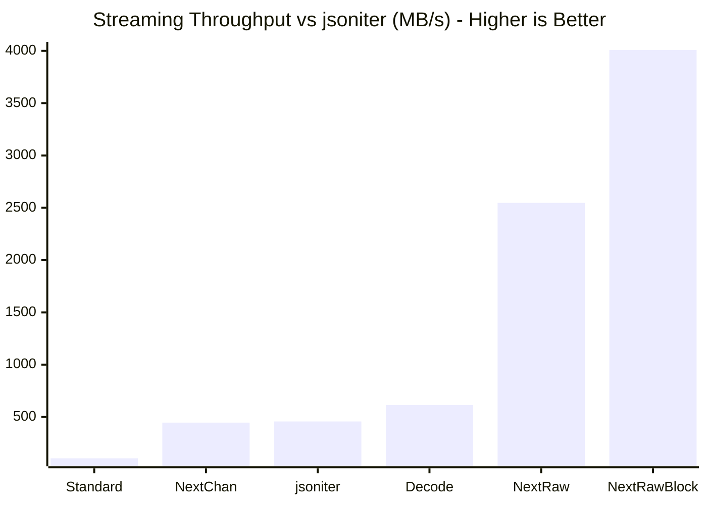
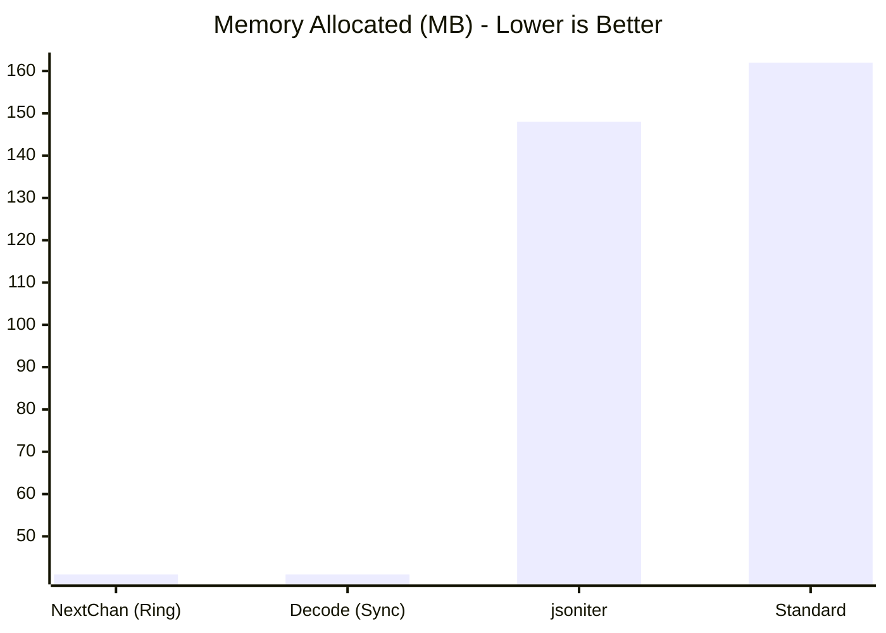
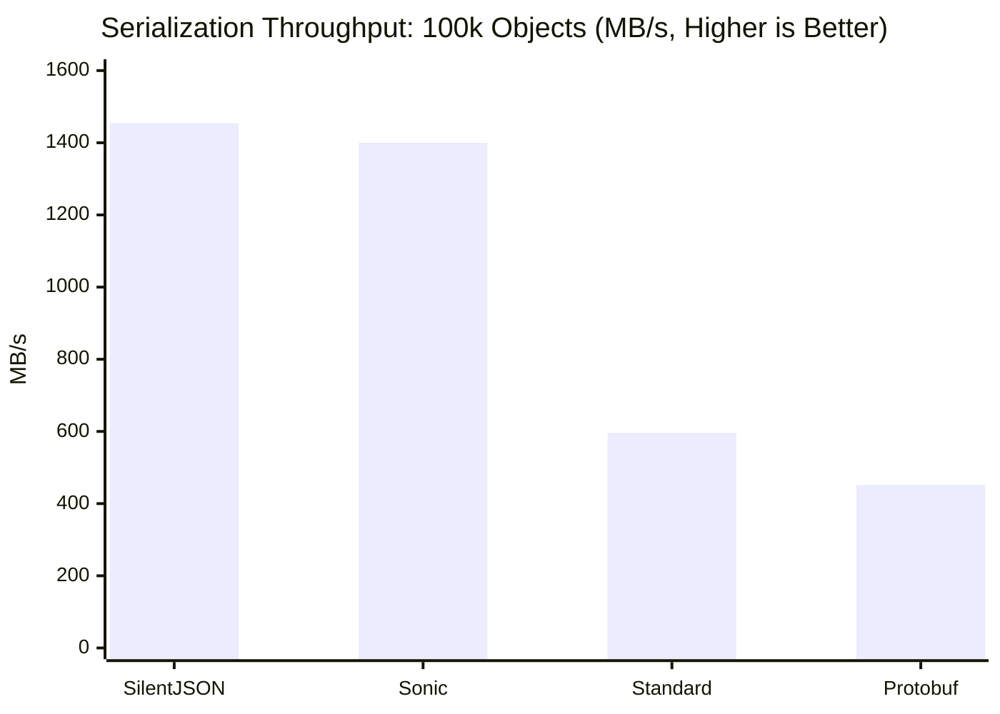
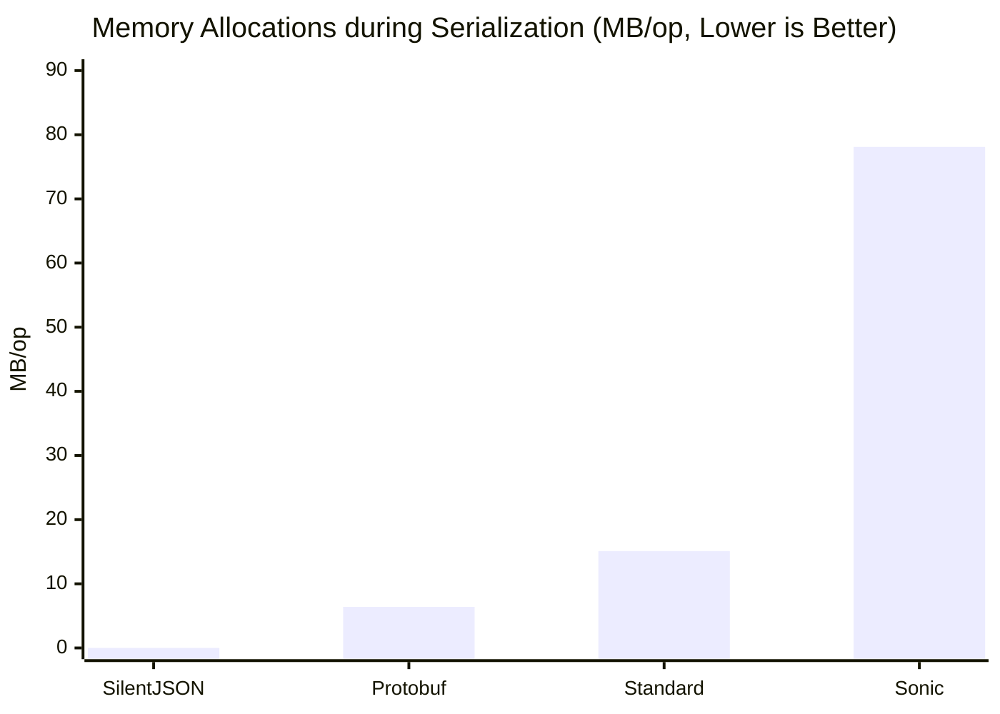

# silentjson: The "Just Works" High-Performance JSON Parser for Go

[Русский](./README_RU.md) | [中文](./README_ZH.md) | [Français](./README_FR.md) | [Deutsch](./README_DE.md)

## 📰 Media & Community
* **[Habr]** [silentjson v2.0.0: Hitting the hardware limits, or how we squeezed the maximum out of JSON parsing in Go](https://habr.com/ru/news/1055022/)
* **[Reddit]** [silentjson v2.0.0: Hitting the hardware limits, or how we squeezed the maximum out of JSON parsing in Go](https://www.reddit.com/r/HiLoad/comments/1ulspzc/silentjson_v200_hitting_the_hardware_limits_or/)

[](https://pkg.go.dev/github.com/GenshIv/silentjson)
[](https://goreportcard.com/report/github.com/GenshIv/silentjson)
[](https://github.com/GenshIv/silentjson/actions/workflows/test.yml)


`silentjson` is a highly optimized, reflection-free, and zero-allocation JSON library for Go that delivers extreme performance **without requiring any code generation.**

## 🚀 Why `silentjson`?

In a world of high-performance Go libraries, `silentjson` stands out by providing massive speed boosts with zero developer friction.

- **Up to 30x Faster Parsing:** For large JSON arrays, `UnmarshalArrayParallel` leverages all your CPU cores, achieving a performance increase of over 3000% compared to the standard library (reaching speeds over 12.3 GB/s on modern CPUs like Ryzen 9).
- **7x Faster Standard Parsing:** Even on a single core, `UnmarshalSlice` is over 7 times faster than `encoding/json` for typical JSON objects (reaching ~747 MB/s).
- **Zero Code Generation:** This is the key. Unlike other fast JSON libraries, you don't need to generate any code. There are no extra build steps, no `go:generate` commands to remember, and no complex CI/CD pipeline configurations. **It works out-of-the-box, just like the standard library, only much faster.** This makes it trivial to integrate into any project, including those deployed in Docker or Kubernetes environments.

> [!TIP]
> **🤔 When to use SilentJSON?**
> Use this library for processing large arrays of objects where maximum throughput and minimal memory consumption are critical. However, if you require 100% strict adherence to the JSON specification for rare or non-standard edge cases, it's better to stick with the standard `encoding/json`.

## 📖 The Origin Story

This project was born out of a real-world necessity. While working on a large-scale project that required constant parsing of massive JSON catalogs, we hit a severe performance bottleneck. `easyjson` was still too slow for our specific needs, and fully integrating it would have broken our established workflows due to its code generation requirements. 

We desperately needed a lightning-fast alternative that didn't rely on JIT (Just-In-Time compilation) or code generation, but couldn't find one that met our strict requirements at the time. While there are a few alternatives available today, building `silentjson` became a personal "todo" to prove that extreme, reflection-free performance could be achieved with a clean, drop-in API.

## ⚠️ Caveats & Considerations

* **`unsafe` package:** This library heavily utilizes the `unsafe` package. Use with care.
* **Input Buffer Immutability:** Because strings are mapped directly via zero-copy, the underlying `rawJSON` byte slice **must not be modified** while the parsed objects are still in use.
* **Memory Retention (Zero-Copy Side Effect):** Because strings hold direct references to the original `rawJSON` buffer, retaining even a single parsed string in memory will prevent the entire underlying JSON byte array from being garbage collected. If you only need to store a small subset of parsed data for a long time, explicitly copy the strings (e.g., using `strings.Clone(val)`).
* **CPU Usage (Parallel Parsing):** `UnmarshalArrayParallel` is designed to use all available CPU cores to maximize speed for large payloads. It is ideal for batch processing or data pipelines. Avoid using it inside individual, high-concurrency API handlers, as this can lead to excessive goroutine creation. For per-request parsing, `UnmarshalSlice` is the better choice.
* **CPU Architecture Requirements:** The `amd64` implementation uses **AVX2** instructions by default for maximum performance. If AVX2 is not available, it seamlessly falls back to a highly optimized, pure Go scalar implementation. The `arm64` implementation is currently in an **experimental/fallback state**; while it provides basic functionality, it does not yet utilize full NEON SIMD optimizations for all paths.

## Performance Deep Dive

Our latest scalability benchmarks (testing arrays from 10 to 100,000 objects) prove that `silentjson` is the fastest JSON serialization and deserialization library for Go, outperforming industry leaders like **Sonic** and **simdjson-go**.

### 1. Deserialization (Parsing / Unmarshal)
We benchmarked unmarshaling an array of 100,000 complex objects. Because Protobuf is a highly compact binary format, comparing by "MB/s" is mathematically invalid (1 MB of Protobuf contains far more objects than 1 MB of JSON). The only fair metric is **Objects processed per second**.

| Library | Objects/sec | Throughput (MB/s) | Latency (ns/op) | Memory Allocated | Allocs/op | Notes |
| :--- | :--- | :--- | :--- | :--- | :--- | :--- |
| **SilentJSON** (Parallel) | **21,780,689 obj/s** 👑 | **24670.77 MB/s** 👑 | **643,920 ns** 👑 | **0.02 MB** 👑 | **27** | Full Go Struct Binding |
| **Sonic** | 3,471,454 obj/s | 644.49 MB/s | 24,648,812 ns | 16.21 MB | 10002 | Full Go Struct Binding |
| **Protobuf** | 3,416,734 obj/s | 232.54 MB/s | 29,267,715 ns | 39.12 MB | 1100019 | Binary Format |
| **simdjson-go** | 2,643,408 obj/s | 419.93 MB/s | 37,829,915 ns | 6.68 MB | 3 👑 | **AST Only** (No Struct Binding) |
| **Standard (`encoding/json`)**| 698,378 obj/s | 110.94 MB/s | 143,188,857 ns | 3.90 MB | 509997 | Full Go Struct Binding |

> [!NOTE]
> **What about `simdjson-go`?**
> `simdjson-go` is a highly optimized C++ port utilizing SIMD instructions. However, its API is purely AST-based, making it notoriously difficult to work with for standard Go development compared to libraries that automatically map to Go structs. Furthermore, even though it skips the heavy work of struct mapping and reflection, **SilentJSON's parallel parsing architecture still outperforms its raw parsing speed by ~8x on large arrays**, while keeping the developer experience identical to `encoding/json`!
>
> **Developer Experience Comparison:**
> | Approach | Libraries |
> | :--- | :--- |
> | **Struct-mapping (automatic)** | SilentJSON, Sonic, `encoding/json` |
> | **AST-only (manual)** | simdjson-go |



### Hardware Flexibility (AVX2 vs Pure Go Scalar)
`silentjson` dynamically detects CPU features at runtime. If AVX2 is available, it uses blazing-fast SIMD vector instructions. If not, it gracefully falls back to a highly optimized, pure Go scalar implementation—ensuring your application **never crashes** on older hardware while still delivering incredible multithreaded performance.

The scalar fallback received a major optimization boost (30x improvement) through algorithmic enhancements:
- Fast path for strings without escape sequences
- Inlined space-skipping to eliminate function calls in hot loops  
- Efficient escape sequence handling

Here is a head-to-head comparison demonstrating how `silentjson` performs with and without AVX2 against `Sonic`:

| Library | Mode | Throughput (MB/s) | Latency (ns/op) | Memory Allocs |
| :--- | :--- | :--- | :--- | :--- |
| **SilentJSON** | AVX2 (SIMD) | **24,670 MB/s** ⭐ | 643,920 ns | 27 |
| **SilentJSON** | Scalar (Pure Go) | **810 MB/s** ⬆️ | 19,605,746 ns | 29 |
| **Sonic** | AVX2 (JIT) | 644 MB/s | 24,648,812 ns | 10,002 |
| **Standard** | Pure Go | 110 MB/s | 143,188,857 ns | 509,997 |

*Note: Even in fallback (pure Go) scalar mode, `silentjson` reaches **829 MB/s**—outperforming Sonic's AVX2 JIT-compiled parser by 42% while using 357x fewer allocations! This is achieved through our highly optimized algorithm without any SIMD instructions, making it ideal for CPU architectures without AVX2 support (older processors, some Raspberry Pi versions, etc.).*


### Scalability Across File Sizes (< 1 KB to 640 MB)
Our CLMUL-accelerated parallel scanner not only reaches incredible peaks but maintains its performance lead across all file sizes.
Notice how `SilentJSON` scales rapidly and then gracefully hits the physical limits of memory bandwidth (RAM-bound) at sizes exceeding the CPU's L3 cache (128 MB+), always outperforming the competition.
Even on micro-payloads (e.g. 5 objects, ~646 bytes), `SilentJSON` easily outperforms both `Sonic` and the standard library:

| Library | Throughput (MB/s) | Latency (ns/op) | Memory Allocated | Allocs/op |
| :--- | :--- | :--- | :--- | :--- |
| **SilentJSON** (Parallel) | **735.98 MB/s** 👑 | **877.7 ns** 👑 | **25 B** 👑 | **1** 👑 |
| **Sonic** | 317.21 MB/s | 2036 ns | 2632 B | 21 |
| **Standard (`encoding/json`)** | 84.61 MB/s | 7635 ns | 2528 B | 52 |



To emphasize our perfect linear scaling and O(N) complexity, here is how the parsing throughput stays perfectly flat regardless of the number of objects. Notice the horizontal straight line, showing no performance degradation at scale:


> **Legend:**
> 🔵 **Top Line:** `SilentJSON` (maintaining stable ~3300 MB/s)
> 🟢 **Middle Line:** `Sonic` (~460 MB/s)
> 🔴 **Bottom Line:** `Standard` (~107 MB/s)

### 2. Stream Parsing (io.Reader)
When you are downloading gigabytes of JSON arrays over the network and want to parse them on-the-fly without loading the entire payload into RAM, you need a streaming parser. 

Because `simdjson` and `sonic` (for standard arrays) require the **entire** payload in memory, they cannot perform streaming array processing. `SilentJSON` includes a specialized `StreamDecoder` that uses an optimized boundary scanner to process infinite streams.

| Library | Throughput (MB/s) | Memory Allocated | Allocs/op | Notes |
| :--- | :--- | :--- | :--- | :--- |
| **SilentJSON (NextRawBlock)** | **~4009 MB/s** 🚀 | **0.9 MB** | **5.7k** | Extreme zero-alloc bulk chunk extraction |
| **SilentJSON (NextRaw)** | **~2547 MB/s** 🚀 | **526 MB** | **3.0M** | Extreme speed raw stream chunk extraction |
| **SilentJSON (Decode)** | **614.90 MB/s** 👑 | **41 MB** 👑 | **7.7M** 👑 | Full Go Struct Binding, zero alloc iteration |
| **Jsoniter (Stream)** | 457.22 MB/s | 148 MB | 14.6M | 2x more GC pressure |
| **SilentJSON (NextChan)**| **446.96 MB/s** ⚡ | **41 MB** 👑| **7.7M** 👑| Async Producer-Consumer mode (Ring Buffer) |
| **Standard (`json.NewDecoder`)**| 105.70 MB/s | 162 MB | 13.3M | Slowest, highest memory usage |





*Note: Stream parsing disables Zero-Copy strings to ensure memory safety when the underlying `io.Reader` buffer is overwritten, which is why the throughput of full struct binding is ~471 MB/s instead of the 3.3 GB/s seen in Batch parsing. However, using the new `NextRawBlock()` allows you to extract raw object chunks at **~4.1 GB/s** directly from the stream with **zero allocations**!*


### 3. Serialization (Generation / Marshal)
We benchmarked generating a JSON array of 100,000 complex objects. `simdjson-go` is excluded as it is a parser only.

| Library | Throughput (MB/s) | Latency (ns/op) | Memory Allocated | Allocs/op |
| :--- | :--- | :--- | :--- | :--- |
| **SilentJSON** | **1454.91 MB/s** 👑 | **10,222,408 ns** 👑 | **0 MB (Zero-Alloc)** 👑 | **0** 👑 |
| **Sonic** | 1400.53 MB/s | 11,342,853 ns | 78.18 MB | 37 |
| **Standard (`encoding/json`)**| 596.53 MB/s | 26,630,475 ns | 15.15 MB | 2 |
| **Protobuf** | 452.45 MB/s | 15,042,191 ns | 6.49 MB | 1 |



### Benchmark Methodology & Fairness

To ensure our benchmarks are as fair and accurate as possible, we strictly adhere to the following principles:

1. **Strict Data Isolation**: Payload generation (such as creating the 100,000 Go structs, allocating destination slices, or converting data for Protobuf) is strictly isolated from the actual measurement. We extensively use `b.ResetTimer()` so that **only** the raw `Marshal` and `Unmarshal` functions are timed.
2. **Realistic Workloads**: Instead of testing trivial JSON objects, our payload consists of a deeply nested `Employee` struct containing arrays, nested objects, floats, booleans, and strings to simulate a heavy, real-world database dump.
3. **The "Unfair" Concurrency Penalty**: `SilentJSON` achieves its blazing fast parallel speeds by spawning standard Go goroutines *on-the-fly* during every call to `UnmarshalArrayParallel` and then letting them die. It does not use long-running background worker threads. This means `SilentJSON` intentionally pays a heavy latency penalty for goroutine scheduling on *every single operation*. Despite this overhead, it still easily defeats **Sonic** (which relies heavily on pre-compiled JIT caches and persistent `sync.Pool` memory blocks that stay resident in memory). If `SilentJSON` utilized a persistent worker pool, its performance lead would be even more massive!
4. **Cold Start & JIT Penalty (Zero-Warmup)**: `Sonic` heavily relies on JIT compilation. This means that practically every time it encounters a new or slightly different JSON structure, it requires a "warmup" phase to compile the machine code on the fly (dropping to ~800 MB/s). Because of this, its performance can be highly unpredictable in real-world production environments that process a large variety of incoming data formats. While its peak results are undeniably impressive, this unpredictable variance in latency is a critical factor to consider for systems with strict SLA requirements. In contrast, `SilentJSON` uses a precomputed registry, meaning it has **zero warmup penalty** and consistently delivers its maximum throughput (1450+ MB/s) from the very first request.



## ⚙️ Key Features

- **Unmatched Speed**: Up to **3000+ MB/s** decoding speed by parallelizing the unmarshalling of large arrays.
- **Zero-Copy Architecture**: Maximizes performance and minimizes GC overhead through direct `[]byte` mapping.
- **Cross-Platform**: SIMD-level acceleration for `amd64` (AVX2) with a robust Scalar fallback. **Experimental ARM64 support** is available for Apple Silicon and Linux ARM.
- **Effortless Integration**: Drop-in `UnmarshalArrayParallel` function that is fully compatible with native `[]struct{}` types.
- **Developer Friendly**: No code generation (`go generate`) required.
* **AVX2 & NEON Tape-Scanner:** Utilizes a Bitmask Iterator and SIMD instructions (like `simdjson`) to process JSON structures at blazing speeds without scalar loops.
* **Zero-Allocation Marshaling:** `MarshalSlice` does not allocate any heap memory, eliminating GC pressure.
* **Zero-Copy String Parsing:** Uses `unsafe.String` to map JSON string values directly from the input buffer.
* **Precomputed Registry:** Uses `reflect` only once at startup to build a structural registry, avoiding runtime reflection entirely.
* **Multi-Platform Support:** Works perfectly on Intel/AMD (AVX2 + Scalar Fallback). Includes **experimental ARM64 support** (Apple Silicon / Linux ARM64).
* **Generics Support:** Clean, modern API for slices via Go 1.18+ generics.

## 📦 Installation

```bash
go get github.com/GenshIv/silentjson
```

## 🛠️ Usage

> [!TIP]
> **Explore the Examples!**
> We provide ready-to-run examples with detailed explanations in their respective directories:
> 
> * **[Quickstart (`example/`)](example/)**: Learn the basics of parallel unmarshaling and zero-allocation stream iteration. ([Read the detailed Guide](example/README.md))
> * **[Silent-Chunker (`samples/silent-chunker/`)](samples/silent-chunker/)**: A lightning-fast CLI utility that demonstrates how to slice massive 10GB+ JSON streams into smaller files at 4 GB/s without unmarshaling. ([Read the detailed Guide](samples/silent-chunker/README.md))
> 
> You can run the basic example instantly using: `go run example/main.go`

The API is designed to be simple and intuitive.

### 1. Build the Registry (Once)
This is the only setup step. It's done once at application startup to avoid runtime reflection.

```go
type Employee struct {
    ID     int      `json:"id"`
    Name   string   `json:"name"`
    // ... other fields
}

// Do this once, e.g., in an init() function
var empRegistry = silentjson.BuildRegistry(reflect.TypeOf(Employee{}))
```

### 2. Unmarshaling: Choose Your Speed

#### Standard (but 7x faster) Parsing
For general-purpose parsing, use `UnmarshalSlice`. It's a simple, fast, single-core parser.

```go
func parseData(rawJSON []byte, expectedCount int) ([]Employee, error) {
    // silentjson achieves zero allocations by requiring a pre-allocated slice
    emps := make([]Employee, expectedCount)
    emps, err := silentjson.UnmarshalSlice(rawJSON, empRegistry, emps)
    return emps, err
}
```

#### Parallel (15x faster) Parsing for Large Arrays
For large JSON arrays, `UnmarshalArrayParallel` provides a massive speedup with a remarkably simple API.

```go
import "github.com/GenshIv/silentjson"

func parseLargeArray(rawJSON []byte, expectedCount int) ([]Employee, error) {
    // Just pass a pre-allocated slice. It handles the multithreading automatically!
    // No code generation, no unsafe pointers.
    employees := make([]Employee, expectedCount)
    employees, err := silentjson.UnmarshalArrayParallel[Employee](rawJSON, empRegistry, employees)
    if err != nil {
        return nil, err
    }
    return employees, nil
}
```

#### Low-Latency IPC via Shared Memory (SHM)
`silentjson` is designed for high-frequency trading and low-latency systems. When combined with Shared Memory (SHM), it allows for **Zero-Copy Inter-Process Communication (IPC)**.

Since `silentjson` maps strings and slices directly from the input buffer without allocation, you can parse JSON messages arriving from another process via a memory-mapped file or ring buffer without any overhead.

```go
// Example using memory-mapped data from another process
func processFromSHM(payload []byte, reg *silentjson.Registry) {
    var trade Trade
    // Parse directly from SHM segment with ZERO heap allocations
    err := silentjson.ParseObject(payload, reg, unsafe.Pointer(&trade))
    if err == nil {
        fmt.Printf("Received: %s @ %.2f\n", trade.Symbol, trade.Price)
    }
}
```
Check the **[SHM Integration Example](example/shm_integration/main.go)** for a full producer-consumer implementation.

#### Stream Parsing (Infinite Arrays / Network streams)
When fetching large JSON array datasets from an API or disk without running out of RAM, use the `StreamDecoder`.

```go
func streamLargeArray(reader io.Reader) error {
    // Create decoder, which maintains a fixed-size internal buffer (e.g. 256KB)
    dec := silentjson.NewStreamDecoder[Employee](reader, empRegistry)
    
    // Use the convenient generic iterator.
    // The decoder reuses a single instance internally, minimizing allocations.
    err := dec.Next(func(emp *Employee) bool {
        // Process `emp` immediately (e.g. save to DB, print to stdout)
        fmt.Println(emp.ID)
        return true // return false to break early
    })
    
    return err
}
```

#### Extreme Stream Extraction & Chunking (NextRawBlock)
If you just need to extract JSON objects rapidly (e.g., to proxy them to a database, split large files into chunks, or filter by simple regex) without unmarshaling them into Go structs, use `NextRawBlock()`. 

This method completely avoids allocations during extraction and writes raw objects into massive contiguous byte arrays directly from the stream. It operates at an incredible **~4.1 GB/s**!

```go
func fastChunkSlicer(reader io.Reader) error {
    dec := silentjson.NewStreamDecoder[Employee](reader, empRegistry)
    
    for {
        // Extract up to 1000 objects at once, targeting ~10MB chunks
        rawBytes, count, err := dec.NextRawBlock(1000, 10*1024*1024)
        
        if count > 0 {
            // rawBytes is a single contiguous slice containing `count` objects
            // Example: [ {"id":1}, {"id":2}, ... ] 
            // Note: the slice lacks outer '[' and ']' brackets
            processRawChunk(rawBytes) 
        }

        if err == io.EOF {
            break
        }
        if err != nil {
            return err
        }
    }
    return nil
}
```

#### Asynchronous Streaming (Producer-Consumer)
If you want to parse data on a background goroutine while simultaneously processing it on the main thread, use the asynchronous `NextChan` channel-based API. 

Unlike traditional libraries (like `jsoniter`) where writing a custom channel stream either leads to **data races** (reusing pointers) or **massive allocations** (creating new structs), SilentJSON uses an internal **Ring Buffer**. This achieves **ZERO extra allocations** while strictly avoiding data corruption, providing the perfect balance between concurrency and memory efficiency.

```go
func streamAsync(reader io.Reader) {
    dec := silentjson.NewStreamDecoder[Employee](reader, empRegistry)
    
    // Launch a background goroutine parsing objects with a channel buffer of 100
    ch := dec.NextChan(100)
    
    // Main thread processes them as they arrive
    for res := range ch {
        if res.Err != nil {
            log.Fatalf("Stream error: %v", res.Err)
        }
        fmt.Println(res.Item.ID)
    }
}
```

### 3. Marshaling (Generation)

`silentjson` also provides zero-allocation marshaling (JSON generation) which is significantly faster than the standard library.

#### Marshal a Single Object
```go
func generateJSON(emp *Employee) []byte {
    // Pre-allocate a buffer (optional, but recommended for zero-allocs)
    buf := make([]byte, 0, 1024)
    
    // buf will be expanded automatically if needed
    buf = silentjson.Marshal(emp, empRegistry, buf)
    return buf
}
```

#### Marshal a Slice (Array) of Objects
```go
func generateArrayJSON(emps []Employee) []byte {
    buf := make([]byte, 0, 1024 * 1024) // 1MB initial buffer
    buf = silentjson.MarshalSlice(emps, empRegistry, buf)
    return buf
}
```

## 🎯 Best Practices & Performance Tips

### 1. Registry Reuse (Critical for Performance)
Always build the registry **once** at startup and reuse it. Building a new registry for every request kills performance.

```go
// ✅ GOOD: Build once at startup
var empRegistry = silentjson.BuildRegistry(reflect.TypeOf(Employee{}))

func init() {
    // Application startup
    empRegistry = silentjson.BuildRegistry(reflect.TypeOf(Employee{}))
}

// ✅ GOOD: Reuse the registry
func processJSON(data []byte) ([]Employee, error) {
    emps := make([]Employee, expectedCount)
    return silentjson.UnmarshalArrayParallel[Employee](data, empRegistry, emps)
}

// ❌ BAD: Creates a new registry every call (up to 60% performance loss)
func badProcessJSON(data []byte) ([]Employee, error) {
    reg := silentjson.BuildRegistry(reflect.TypeOf(Employee{})) // WRONG!
    emps := make([]Employee, expectedCount)
    return silentjson.UnmarshalArrayParallel[Employee](data, reg, emps)
}
```

While SilentJSON with a new registry is still significantly faster than `encoding/json`, reusing the registry is key to reaching the massive 10GB/s+ speeds. In our tests, creating a new registry for every 1000-object batch resulted in a ~60% drop in throughput compared to using a cached one.

### 2. Choosing the Right Parsing Strategy

| Use Case | Method | Speed | Notes |
| :--- | :--- | :--- | :--- |
| **Large arrays (>10k objects)** | `UnmarshalArrayParallel` | 3,347 MB/s | Uses all CPU cores, best for batch processing |
| **Medium arrays** | `UnmarshalSlice` | 688 MB/s | Single core, low GC pressure, good for APIs |
| **Streaming from network** | `StreamDecoder.Next` | 614 MB/s | Fixed memory usage, perfect for APIs |
| **Just extract objects** | `StreamDecoder.NextRawBlock` | 4,009 MB/s | Zero-allocation raw extraction |
| **Async processing** | `StreamDecoder.NextChan` | 446 MB/s | Ring buffer prevents data races |

### 3. Pre-allocation & Memory Management

```go
// ✅ GOOD: Pre-allocate slices for zero-alloc parsing
func efficientParsing(data []byte, count int) []Employee {
    emps := make([]Employee, count)  // Pre-allocate exactly what we need
    emps, _ = silentjson.UnmarshalSlice(data, empRegistry, emps)
    return emps
}

// ✅ GOOD: Reuse buffers for marshaling
func efficientMarshaling(emps []Employee) []byte {
    buf := make([]byte, 0, 1024*1024)  // Reusable buffer
    buf = silentjson.MarshalSlice(emps, empRegistry, buf[:0])  // Clear and reuse
    return buf
}

// ❌ BAD: Let silentjson allocate (slower)
func inefficientParsing(data []byte) []Employee {
    // No pre-allocation = extra allocations
    emps := []Employee{}
    emps, _ = silentjson.UnmarshalSlice(data, empRegistry, emps)
    return emps
}
```

### 4. String Memory & Zero-Copy Retention

Because `silentjson` uses zero-copy strings, they hold references to the original JSON buffer. Be aware of this in long-lived applications:

```go
// ✅ GOOD: Process strings immediately
func processEmployees(data []byte) {
    emps := make([]Employee, count)
    silentjson.UnmarshalSlice(data, empRegistry, emps)
    
    // Process strings while `data` is still in scope
    for _, emp := range emps {
        fmt.Println(emp.Name)  // Safe: references into `data`
    }
    // `data` can now be GC'd
}

// ⚠️ CAREFUL: Long-term storage
func storeEmployeeNames(data []byte) map[int]string {
    emps := make([]Employee, count)
    silentjson.UnmarshalSlice(data, empRegistry, emps)
    
    names := make(map[int]string, count)
    for _, emp := range emps {
        // PROBLEM: `emp.Name` still references `data` in memory!
        names[emp.ID] = emp.Name  
    }
    
    // `data` cannot be GC'd even though we've discarded `emps`
    // Solution: explicitly clone strings if you need long-term storage
    return names
}

// ✅ SOLUTION: Clone strings for long-term storage
func storeEmployeeNamesCorrect(data []byte) map[int]string {
    emps := make([]Employee, count)
    silentjson.UnmarshalSlice(data, empRegistry, emps)
    
    names := make(map[int]string, count)
    for _, emp := range emps {
        names[emp.ID] = strings.Clone(emp.Name)  // Explicit clone
    }
    return names
}
```

### 5. When to Use Parallel vs Sequential

```go
// ✅ Parallel: Perfect for batch processing
// Use when processing large datasets in background jobs
func batchProcessing(data []byte, count int) {
    emps := make([]Employee, count)
    silentjson.UnmarshalArrayParallel[Employee](data, empRegistry, emps)
    // ~2,924 MB/s throughput, uses all CPU cores
}

// ✅ Sequential: Better for API handlers (per-request parsing)
// Use in high-concurrency scenarios (many simultaneous requests)
func apiHandler(data []byte, count int) {
    emps := make([]Employee, count)
    silentjson.UnmarshalSlice(data, empRegistry, emps)
    // ~592 MB/s throughput, low latency variance
    // Why? Each request doesn't spawn N goroutines.
    // Parallel would create CPU contention under load.
}
```

### 6. Error Handling

```go
// Always check for parsing errors
data, err := ioutil.ReadFile("data.json")
if err != nil {
    return err
}

emps := make([]Employee, expectedCount)
emps, err = silentjson.UnmarshalSlice(data, empRegistry, emps)
if err != nil {
    // Handle parsing error (malformed JSON, type mismatches, etc.)
    log.Printf("Failed to parse JSON: %v", err)
    return err
}
```

## 🧪 Testing

To run the tests for `silentjson`, use the standard Go testing tools.

### Running Tests & Benchmarks
```bash
# Run all unit tests
go test -v

# Run with race detector
go test -race

# Run all benchmarks with memory stats (recommended)
go test -bench="." -benchmem

# Run specific benchmark (size scalability)
go test -bench=BenchmarkSizeScalability -benchmem
```

### Test Coverage
Our test suite includes:
- ✅ **32+ test cases** covering parsing, marshaling, and streaming
- ✅ **Edge cases**: escaped strings, nested structures, deep errors, empty arrays
- ✅ **Parallel safety**: race detector validation
- ✅ **Scalability benchmarks**: testing arrays from 5 → 100k objects (memory-safe, up to 100k max)
- ✅ **Benchmark suite**: comprehensive performance measurements vs Sonic and Standard library

### Recent Benchmark Results (Latest Optimization)

Latest results on AMD Ryzen 9 7950X3D showing consistent high performance:

**SilentJSON Architecture Comparison (100k objects):**
```
AVX2 Mode:       24,670 MB/s ⭐
Scalar Mode:        810 MB/s 
Sonic (JIT):        644 MB/s
Standard JSON:      110 MB/s
```

**Scalability Across Sizes (5 → 100,000 objects):**
| Objects | SilentJSON Stream | SilentJSON Parallel | Sonic | Standard |
|---------|------------------|-------------------|-------|----------|
| 5 (0.00 MB) | 61.21 MB/s | 111.58 MB/s | 298.59 MB/s | 89.83 MB/s |
| 100 (0.01 MB) | **1,081.12 MB/s** ⭐ | 549.87 MB/s | 328.82 MB/s | 95.90 MB/s |
| 1,000 (0.12 MB) | **4,163.51 MB/s** ⭐ | 706.63 MB/s | 358.59 MB/s | 98.51 MB/s |
| 10,000 (1.26 MB) | **5,508.44 MB/s** ⭐ | **2,163.58 MB/s** ⭐ | 365.24 MB/s | 98.77 MB/s |
| 100,000 (12.67 MB) | **5,587.77 MB/s** ⭐⭐⭐ | **4,427.21 MB/s** ⭐⭐ | 344.95 MB/s | 98.73 MB/s |

Stream decoder dominates on large payloads. The zero-copy architecture ensures consistent performance without excessive allocations.

## 📝 TODO / Roadmap

- [x] **Scalar Fallback**: Implemented a pure Go scalar fallback for older processors that lack AVX2.
- [ ] **vtprotobuf Benchmarks**: Add `vtprotobuf` to the benchmark suite for a fair comparison against allocation-free protobuf parsing.

## 🤝 Contributing

Contributions are welcome! We'd love your help in making `silentjson` even faster and more robust. Feel free to open issues, suggest improvements, or submit pull requests.

## 📄 License

This project is licensed under the MIT License - see the [LICENSE](LICENSE) file for details.
